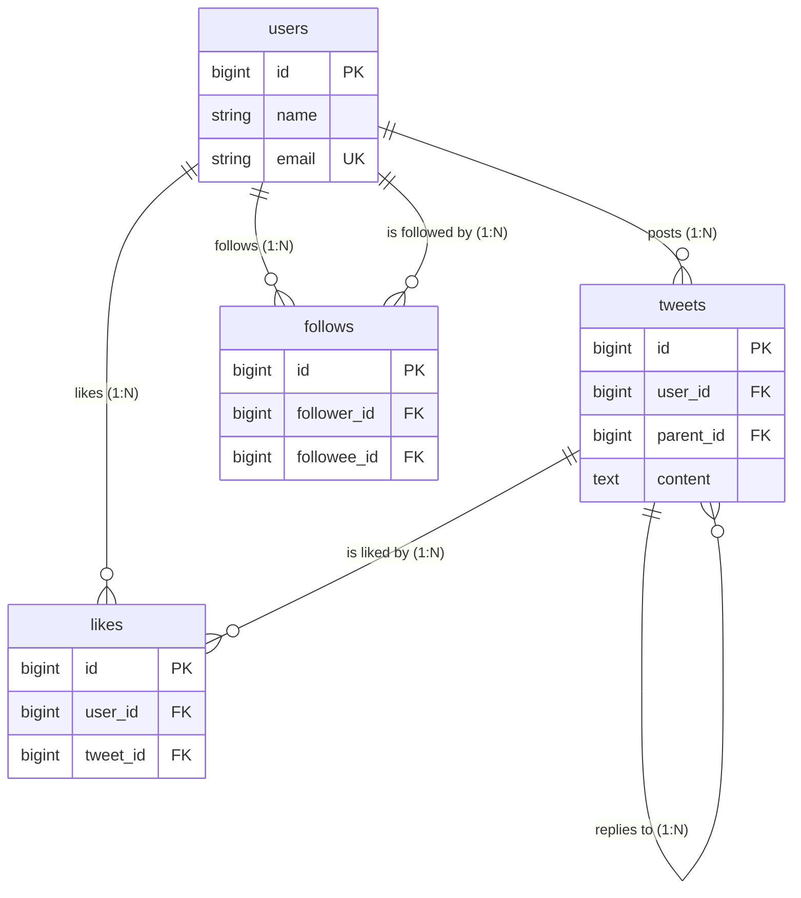

# Database Schema (データの保存構造)

> [!NOTE]
> アプリケーションが満たすべきデータベース仕様とデータの「構造」「型」を定義します。
> SNSアプリ（Twitterクローン）のコアをなすテーブル設計です。

## ER Diagram (全体関係図)

---

## Table Details (詳細定義)

### 1. users

ユーザーの基本情報を管理するテーブル。

| Column            | Type            |  Key   | Nullable | Default | Description              |
| :---------------- | :-------------- | :----: | :------: | :------ | :----------------------- |
| **id**            | unsigned bigint | **PK** |    No    |         | 自動採番ID               |
| name              | string          |        |    No    |         | ユーザー名（表示名）     |
| email             | string          | **UK** |    No    |         | メールアドレス           |
| email_verified_at | timestamp       |        |   Yes    |         | メール確認日時           |
| password          | string          |        |    No    |         | パスワード (Hash)        |
| profile_text      | string(160)     |        |   Yes    |         | プロフィール・自己紹介文 |
| remember_token    | string          |        |   Yes    |         | ログイン保持トークン     |
| created_at        | timestamp       |        |   Yes    |         | 作成日時                 |
| updated_at        | timestamp       |        |   Yes    |         | 更新日時                 |

### 2. tweets

ユーザーの投稿（ツイート）を管理するテーブル。

| Column        | Type            |  Key   | Nullable | Default | Description                                           |
| :------------ | :-------------- | :----: | :------: | :------ | :---------------------------------------------------- |
| **id**        | unsigned bigint | **PK** |    No    |         | 自動採番ID                                            |
| **user_id**   | unsigned bigint | **FK** |    No    |         | `users(id)` への外部キー (Cascade Delete)             |
| **parent_id** | unsigned bigint | **FK** |   Yes    |         | `tweets(id)` への外部キー（返信先ツイートID。NULL可） |
| content       | string(140)     |        |    No    |         | 投稿本文 (140文字制限)                                |
| created_at    | timestamp       |        |   Yes    |         | 作成日時                                              |
| updated_at    | timestamp       |        |   Yes    |         | 更新日時                                              |

> **構造:** 返信（コメント）機能は、ツイート自体に `parent_id` を持たせる「自己参照」で実現する。これにより、コメントに対しても「いいね」や「さらなる返信」が標準仕様のまま可能となる（Twitter完全互換の仕様）。

### 3. likes

ツイートに対する「いいね（ハート）」履歴を管理する中間テーブル。

| Column       | Type            |     Key      | Nullable | Default | Description                                |
| :----------- | :-------------- | :----------: | :------: | :------ | :----------------------------------------- |
| **id**       | unsigned bigint |    **PK**    |    No    |         | 自動採番ID                                 |
| **user_id**  | unsigned bigint | **FK(複合)** |    No    |         | `users(id)` への外部キー (Cascade Delete)  |
| **tweet_id** | unsigned bigint | **FK(複合)** |    No    |         | `tweets(id)` への外部キー (Cascade Delete) |
| created_at   | timestamp       |              |   Yes    |         | 作成日時（いいねした日時）                 |
| updated_at   | timestamp       |              |   Yes    |         | 更新日時                                   |

> **制約:** `user_id` と `tweet_id` の組み合わせで**ユニーク（一意）制約**を設けることで、1ユーザーが同一ツイートに複数回「いいね」できないようにする。

### 4. follows

ユーザー同士の「フォロー・フォロワー」関係を管理する自己参照中間テーブル。

| Column          | Type            |     Key      | Nullable | Default | Description                                  |
| :-------------- | :-------------- | :----------: | :------: | :------ | :------------------------------------------- |
| **id**          | unsigned bigint |    **PK**    |    No    |         | 自動採番ID                                   |
| **follower_id** | unsigned bigint | **FK(複合)** |    No    |         | `users(id)` への外部キー（フォローする側）   |
| **followee_id** | unsigned bigint | **FK(複合)** |    No    |         | `users(id)` への外部キー（フォローされる側） |
| created_at      | timestamp       |              |   Yes    |         | 作成日時（フォローした日時）                 |
| updated_at      | timestamp       |              |   Yes    |         | 更新日時                                     |

> **制約:** `follower_id` と `followee_id` の組み合わせで**ユニーク（一意）制約**を設けることで、二重フォローを防ぐ。また、自分自身をフォローできないチェック（Check制約またはアプリケーション制御）を行う。
